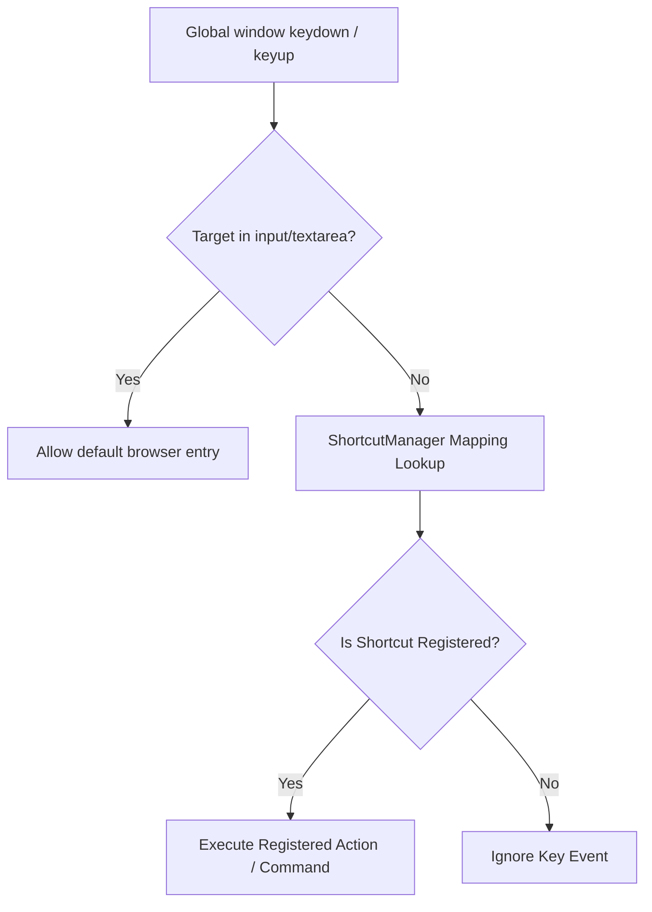

# Drawing Engine Architecture

The DesignDeck drawing engine is a modular, high-performance canvas controller designed for real-time collaboration.

## Core Components

### 1. CanvasEngineController
The main entry point. It orchestrates all managers and handles:
- Captures raw pointer events and routes them to the active tool.
- Manages the `requestAnimationFrame` loop to draw layers and objects.
- Holds the local zoom, pan, and active tool state.

### 2. Tool Manager System
Tools follow a standard interface (`BaseTool.js`):
- `onPointerDown`/`onPointerMove`/`onPointerUp`: Handle interaction.
- `renderPreview`: Allows tools to draw "ghost" objects (like a box outline while dragging) before committing.
- **Current Tools**: `PenTool`, `ShapeTool`, `TextTool`, `SelectTool`, `EraserTool`.

### 3. Scene Management
- **SceneManager**: Maintains the Z-order list of objects.
- **Objects**: Every object is a JSON description with `geometry` and `style`. No pixels are stored; everything is re-rendered from these descriptions.

### 4. History (Undo/Redo)
Implemented using the **Command Pattern**:
- Every action (Add, Remove, Transform) is a `Command` object.
- `HistoryManager` tracks these in a stack.
- `BatchCommand` allows grouping multiple actions (like moving 10 selected items) into one undo step.

## 5. Synchronization (Yjs)
DesignDeck uses **CRDTs** (Conflict-free Replicated Data Types) via Yjs.
- **Shared Objects**: All drawing objects are stored in a `Y.Map`.
- **Latency Compensation**: Changes are applied locally first and synced in the background.
- **Awareness**: Handles remote cursor locations and selection highlights using `y-awareness`.

## 6. Input Management & Safeguards
The engine uses global window listeners for shortcuts but includes an `isInputField` check to prevent interference with UI elements (like Chat).
- **Interception**: If the user is focused on an `INPUT`, `TEXTAREA`, or `contenteditable`, the engine returns early.
- **Keys Protected**: `Backspace` (Delete object), `Space` (Pan), `Ctrl+Z` (Undo).

## 7. Proposed Keyboard Shortcut Manager Architecture (Future Enhancement)

To modularize keyboard interactions and support custom key bindings, a new `ShortcutManager` module can be introduced.

### Architectural Layout & Flow


### Action Registration Design
The `ShortcutManager` will store actions as callbacks or commands mapped to string key configurations:
```javascript
class ShortcutManager {
  constructor(engineController) {
    this.controller = engineController;
    this.shortcuts = new Map();
    this.initListeners();
  }

  register(keys, actionName, callback) {
    this.shortcuts.set(keys.toLowerCase(), { actionName, callback });
  }

  handleEvent(event) {
    if (this.isInputField(event.target)) return;
    
    const keyCombo = this.getEventKeyCombo(event);
    const registered = this.shortcuts.get(keyCombo);
    if (registered) {
      event.preventDefault();
      registered.callback(event);
    }
  }
}
```
