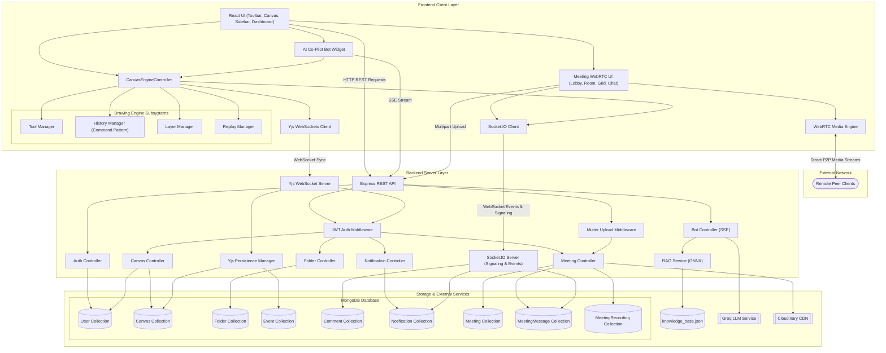

# DesignDeck — Real-Time Collaborative Digital Canvas

DesignDeck is a premium real-time collaborative digital canvas designed for team brainstorming, canvas drawing, and interactive session replays. It integrates modern WebSockets, CRDT-based state synchronization, and a sleek user interface to empower teams to work together seamlessly.

---

## System Architecture

DesignDeck is powered by a high-performance decoupled architecture designed for fluid vector calculations, minimal network overhead, and zero-conflict collaborative drawing.

### DesignDeck System Architecture

This diagram illustrates the core drawing, state synchronization, real-time database persistence, WebRTC video calling, and external asset processing pipeline.



### Architectural Pipeline Breakdown

1. **State Sync Pipeline (Yjs over WebSockets)**:
   All shared geometric layers, brush strokes, and vector shapes are kept in-sync via Conflict-free Replicated Data Types (CRDTs). As users interact with the canvas, modifications are locally resolved in memory and transmitted directly over raw WebSockets (`/`) using binary-serialized buffers. This bypasses HTTP overhead entirely, enabling sub-30ms coordinate replication across all active cursors.

2. **Transactional Pipeline (Socket.IO)**:
   Low-frequency collaboration features (such as live canvas comment notifications, team chats, cursor location streams, and permission level updates) are separated into a dedicated Socket.IO instance (`/socket.io/`). This isolates raw high-frequency coordinate tracking from transactional metadata, preventing synchronization locks or thread blockages.

3. **Event-Driven History Throttling**:
   To capture real-time time-travel replays without saturating the MongoDB server, a throttled database persistence manager buffers canvas updates in RAM and writes a binary representation (`Y.encodeStateAsUpdate(doc)`) to the database every 250ms.

4. **Cache-Evicting Rollback Engine**:
   To prevent clients from serving outdated cached files when rolling back state, the backend updates the canvas database entry and forcefully deletes the server's in-memory active YDoc representation, evicting the client caches and forcing a complete re-synchronization directly from MongoDB.

5. **Canvas-Aware AI Co-Pilot & RAG Pipeline**:
   The chatbot leverages a local RAG semantic search using the `all-MiniLM-L6-v2` transformer model (via Xenova) to query in-memory cached vector embeddings of product help docs. The backend feeds the matching document contexts and a token-trimmed JSON representation of the canvas state to the Groq LLM API. The LLM streams conversational answers and JSON canvas commands back over Server-Sent Events (SSE). The client parses this stream and executes modifications directly on the drawing canvas.

6. **WebRTC Signaling & P2P Media Pipeline**:
   Real-time video, audio, and screen sharing are driven by standard browser WebRTC APIs, using Socket.IO as the signaling plane. When a user joins a meeting room:
   - A Socket.IO event `join-room` is dispatched, updating the `Meeting` participant list in MongoDB and notifying other active clients.
   - Sockets handle the exchange of session descriptions (SDP offers/answers) and connection candidates (`ice-candidate`) to establish direct Peer-to-Peer `RTCPeerConnection` channels between clients.
   - Media channels (microphones, webcams, screens) are streamed directly P2P, bypassing server processing to minimize latency and bandwidth consumption.
   - Host-initiated controls (muting, video locking, disabling collaboration, or setting participant permission roles) are instantly synced across all peers using custom Socket.IO events (`host-control-change` -> `host-control-updated`).

7. **Call Recording & CDN Persistence Pipeline**:
   Users can record active screen sharing and meeting media streams. The frontend utilizes the browser `MediaRecorder` API to capture and stream WebM video chunks. Upon stopping the call recording, the binary stream is compiled and sent via a multipart Form Data upload handled by Express and `Multer`. The backend processes this file locally, uploads it securely to `Cloudinary CDN`, saves the hosted asset URL link in the `MeetingRecording` database collection, and removes the local temporary file.

8. **Workspace Folder & Hierarchy Directory Pipeline**:
   Canvases are organized hierarchically inside dynamic workspaces. Folder routes handle directory traversal, folder creations, renames, and deletions. Each canvas document maintains a reference to its parent folder ID, enabling seamless directory relocation, dashboard listings, and clean folder-scoped project organizations.

9. **Transactional Alert & Notification Engine**:
   Real-time workspace collaborations, canvas share links, scheduled meeting start prompts (polled every 30 seconds by a background server scheduler), and access-request approvals are routed instantly to active users using Socket.IO events. These are backed by persistent storage in the `Notification` collection to provide a persistent activity history log in user dashboards.

---

## Key Features

*   **Real-Time CRDT Canvas Collaboration**: Powered by `Yjs` and WebSocket endpoints for low-latency, conflict-free drawing and object synchronization.
*   **WebRTC Video/Audio Conference Rooms**: Full-screen workspace-integrated meeting rooms allowing collaborators to hold live video/audio conference calls directly inside canvas rooms. Includes a pre-call Lobby for camera/microphone preview, dynamic participant grids, and robust peer signaling.
*   **Host-Controlled Meeting Sync**: Meeting hosts can manage active sessions, mute/unmute participants, toggle cameras, disable chat panels, restrict canvas editing, or adjust user access permissions in real-time.
*   **Screen Sharing & Call Recording**: Share your screen with other call participants and record meeting screen shares/audio feeds, which are automatically processed on the server and uploaded to Cloudinary for instant playback and history logs.
*   **Active Properties Inspector Sync**: Modify selected shape properties (color palette, stroke width, opacity, text fonts, fill modes) in real-time.
*   **AI Co-Pilot & RAG Assistant**: Ask the chatbot about drawing shapes, styling elements, grid formatting, or platform guidelines, streaming responses and actions over Server-Sent Events (SSE).
*   **Stale Cursor Suppression**: Automatic cursor cleanup logic that clears inactive pointers after 5 seconds to eliminate duplicate trails during page reconnections.
*   **Granular Layer Control**: Create, reorder, delete, rename, lock, toggle visibility, and adjust opacity of multiple layers on the canvas.
*   **Time-Travel Replays**: Record updates, play, pause, step forward/backward, and control playback speed of canvas state changes using custom timeline playback controls.
*   **Collaborator Tracking**: View who is active on the canvas with color-coded tags and cursor position tracking.
*   **Persistent & Interactive Comments**: Direct chat box communication combined with targeted object-specific comments.
*   **Sharing & Security Control**: Securely share canvases with specific collaborator access roles (Viewer/Editor) and custom expiration timers.
*   **Real-Time Role Synchronization**: Instant interface layout updates and permission enforcement when a collaborator's access role (Viewer <-> Editor) is changed by the owner in real-time.
*   **Premium Responsive Dashboard**: Secure User authentication (JWT) with forms for login and registration, profile customization, and intuitive management of active canvases.

---

## Tech Stack

### Frontend
*   **Framework**: React (Vite-powered)
*   **Styling**: Tailwind CSS & Modern Design CSS Tokens
*   **Real-time Collaboration**: Yjs, `y-websocket` client
*   **Communication**: Socket.IO-client for interactive comments, chat, and role synchronization
*   **Media Streaming**: WebRTC PeerConnection APIs for real-time camera/audio/screen channels
*   **Icons**: Lucide React

### Backend
*   **Runtime Environment**: Node.js
*   **Web Framework**: Express
*   **Database**: MongoDB with Mongoose ODM
*   **Real-time Services**: WebSocketServer (`ws`), `y-websocket` utility hub, and Socket.IO
*   **Asset Management**: Cloudinary Node.js SDK and Multer for meeting screen recording uploads
*   **AI Engine**: Groq SDK for real-time streamed canvas command completions
*   **Authentication**: JSON Web Token (JWT) & bcryptjs hashing

---

## Project Structure

The clean, standardized folder structure is organized as follows:

```text
DesignDeck/
├── Backend/                                                 # Server-side backend environment
│   ├── config/                                              # External API and environment loaders
│   │   ├── cloudinary.js                                    # Connects and authenticates with Cloudinary CDN #
│   │   └── env.js                                           # Loads .env files into process.env environment #
│   ├── controllers/                                         # REST API controllers
│   │   ├── authController.js                                # Handles user login and registration routes
│   │   ├── botController.js                                 # Handles AI chatbot conversations, RAG search, and SSE streaming
│   │   ├── canvasController.js                              # Handles canvases, memberships, links, and role sockets
│   │   ├── folderController.js                              # Handles directories and workspace canvas groupings #
│   │   ├── meetingController.js                             # Handles video calls schedule, WebRTC, and recordings #
│   │   └── notificationController.js                        # Handles user alerts, meeting notifications, and link invites #
│   ├── data/                                                # Database seeding and knowledge base directory
│   │   └── knowledge_base.json                              # Platform help guidelines database for RAG context retrieval
│   ├── middleware/                                          # Express routing middleware
│   │   └── authMiddleware.js                                # Secures routes using JWT authorization guards
│   ├── models/                                              # MongoDB schema definitions (Mongoose)
│   │   ├── Canvas.js                                        # Canvas database model with layers and metadata
│   │   ├── Comment.js                                       # Canvas object-level comments database schema
│   │   ├── Event.js                                         # Replay timeline updates database structure
│   │   ├── Folder.js                                        # Workspaces and canvas directories database schema #
│   │   ├── Meeting.js                                       # Active and scheduled video calls database schema #
│   │   ├── MeetingMessage.js                                # Live call chat messages history database schema #
│   │   ├── MeetingRecording.js                              # Meeting screen share video URLs database schema #
│   │   ├── Notification.js                                  # User invite alerts and message logs database schema #
│   │   └── User.js                                          # Registered user accounts database schema
│   ├── routes/                                              # Express API routes
│   │   ├── authRoutes.js                                    # Maps auth endpoints to authController
│   │   ├── botRoutes.js                                     # Maps bot routes to botController
│   │   ├── canvasRoutes.js                                  # Maps canvas and branch endpoints to canvasController
│   │   ├── commentRoutes.js                                 # Maps comment endpoints to commentController
│   │   ├── folderRoutes.js                                  # Maps directory endpoints to folderController #
│   │   ├── meetingRoutes.js                                 # Maps video recording and WebRTC to meetingController #
│   │   └── notificationRoutes.js                            # Maps alert endpoints to notificationController #
│   ├── services/                                            # Core server-side business logic helper modules
│   │   └── RAGService.js                                    # Local vector embedding search using all-MiniLM-L6-v2
│   ├── tests/                                               # Automated integration tests
│   │   └── meeting.test.js                                  # Asserts meeting scheduling and recording uploads
│   ├── package-lock.json                                    # Node.js backend dependencies lockfile
│   ├── package.json                                         # Node.js backend configuration and scripts
│   └── server.js                                            # Main server starting HTTP, socket.io, and WS servers
├── Devdocs/                                                 # Technical reference manuals & system specifications
│   ├── api_reference.md                                     # Complete REST API directory and collaborative WebSocket protocols
│   └── engine_architecture.md                               # Modular drawing engine components and Yjs CRDT synchronization
├── Frontend/                                                # React frontend powered by Vite
│   ├── public/                                              # Public static assets
│   │   └── vite.svg                                         # Vite static branding resource icon
│   ├── src/                                                 # Frontend source code
│   │   ├── assets/                                          # Static media assets and logos
│   │   │   └── react.svg                                    # React logo graphic asset
│   │   ├── components/                                      # Modular React interface elements
│   │   │   ├── Bot/                                         # AI Co-Pilot chatbot widget UI components
│   │   │   │   ├── BotWidget.css                            # Styling for the AI Co-Pilot floating widget panel
│   │   │   │   └── BotWidget.jsx                            # Renders bot floating action buttons and chats
│   │   │   ├── Meeting/                                     # Video conference components #
│   │   │   │   ├── ChatPanel.jsx                            # Live in-call text chat panel #
│   │   │   │   ├── MeetingControls.jsx                      # Device toggles, screen share, and recording control bar #
│   │   │   │   ├── MeetingHistory.jsx                       # View and download meeting recordings #
│   │   │   │   ├── MeetingLobby.jsx                         # Audio and video settings select overlay #
│   │   │   │   ├── MeetingRoom.jsx                          # Draggable, minimizable calling canvas overlay #
│   │   │   │   └── ParticipantGrid.jsx                      # Resizable grid rendering remote peer feeds #
│   │   │   ├── Sidebar/                                     # Right side sidebar panels
│   │   │   │   ├── LayerRow.jsx                             # Renders a single layer row with controls
│   │   │   │   ├── LayersPanel.jsx                          # Renders layers lists, locks, and visibilities
│   │   │   │   ├── PropertiesPanel.jsx                      # Custom color picker, sizes, fonts, and grids
│   │   │   │   └── SidebarPanel.jsx                         # Direct container for Layers and Properties
│   │   │   ├── __tests__/                                   # Automated UI component tests
│   │   │   │   ├── Dashboard.test.jsx                       # Tests user dashboard canvases search and listings
│   │   │   │   ├── RBAC_Components.test.jsx                 # Verifies role-based restrictions on topbar and toolbar
│   │   │   │   └── ShareDialog.test.jsx                     # Asserts link sharing and collaborator role updates
│   │   │   ├── Canvas.jsx                                   # React wrapper initializing CanvasEngineController
│   │   │   ├── ChatPanel.jsx                                # Object-level discussion threads using Socket.io
│   │   │   ├── CollaboratorList.jsx                         # Active collaborator lists and follow modes
│   │   │   ├── Dashboard.jsx                                # Active canvases lists, favorites, and creation forms
│   │   │   ├── Footer.jsx                                   # Collaborative bottom details bar
│   │   │   ├── JoinCanvas.jsx                               # Invites link target verification screen
│   │   │   ├── LandingPage.jsx                              # Premium promotional welcome page
│   │   │   ├── Login.jsx                                    # Premium secure user session forms
│   │   │   ├── NotificationSystem.jsx                       # Displays real-time collaborator popups
│   │   │   ├── Profile.jsx                                  # Customizes user profile details and settings
│   │   │   ├── Register.jsx                                 # Form to create new user accounts
│   │   │   ├── ReplayCanvas.jsx                             # Replay modal canvas window
│   │   │   ├── ShareDialog.jsx                              # Link sharing and team permissions manager
│   │   │   ├── TimelineControls.jsx                         # Custom timeline controls for playback
│   │   │   ├── Toolbar.jsx                                  # Drawing tool selector bar with RBAC checks
│   │   │   └── TopBar.jsx                                   # Canvas header displaying share triggers
│   │   ├── context/                                         # Contextual state providers
│   │   │   ├── ThemeContext.js                              # Theme Context definition
│   │   │   ├── ThemeProvider.jsx                            # Renders Tailwind custom wrappers for theme styles
│   │   │   └── themes.js                                    # Global stylesheet attributes map
│   │   ├── Engine/                                          # Core Figma-style canvas drawing engine
│   │   │   ├── __tests__/                                   # Drawing engine unit tests
│   │   │   │   └── YjsSync.test.js                          # Verifies collaborative syncing and conflict resolution
│   │   │   ├── managers/                                    # Orchestrators and state controllers
│   │   │   │   ├── HistoryManager.js                        # Implements local undo/redo actions (Command Pattern)
│   │   │   │   ├── LayerManager.js                          # Controls active layers list and rendering ordering
│   │   │   │   ├── ReplayManager.js                         # Handles timeline travel playback loop
│   │   │   │   ├── SceneManager.js                          # Stores active objects list and order index map
│   │   │   │   └── ToolManager.js                           # Handles tool selection and contextual options
│   │   │   ├── scene/                                       # Structural geometry nodes
│   │   │   │   ├── geometry.js                              # Core vector bounds math definitions
│   │   │   │   ├── hitTest.js                               # Element collision utilities
│   │   │   │   ├── selectionBox.js                          # Draws dashed select box around selected items
│   │   │   │   └── StrokeNode.js                            # Formats freehand pen lines into geometric maps
│   │   │   ├── ToolManager.js                               # Component managing sidebar settings options
│   │   │   ├── Tools/                                       # Drawing and modification tools
│   │   │   │   ├── __tests__/                               # Tools unit testing suite
│   │   │   │   │   └── EngineTools.test.js                  # Asserts tool activation, cursor, and preview events
│   │   │   │   ├── BaseTool.js                              # Abstract parent class for all drawing tools
│   │   │   │   ├── CircleTool.js                            # Handles drawing and updates for circle shapes
│   │   │   │   ├── DrawTool.js                              # Handles freehand brush drawing on the canvas
│   │   │   │   ├── EraserTool.js                            # Handles element deletion and eraser strength paths
│   │   │   │   ├── EyedropperTool.js                        # Custom tool to pick colors from elements
│   │   │   │   ├── FillTool.js                              # Custom tool to toggle shape background colors
│   │   │   │   ├── LineTool.js                              # Handles drawing straight connection lines
│   │   │   │   ├── RectangleTool.js                         # Handles drawing and editing box shapes
│   │   │   │   ├── SelectTool.js                            # Core tool for selecting, dragging, resizing elements
│   │   │   │   ├── ShapeTools.js                            # Parent class and logic for complex shapes
│   │   │   │   ├── TextTool.js                              # Handles text input overlay, fonts, and geometry
│   │   │   │   └── Tool.js                                  # Base interface for active canvas tools
│   │   │   ├── utils/                                       # Core engine mathematical helpers
│   │   │   │   ├── BezierSmoothing.js                       # Smooths pencil strokes using Bezier curve algorithms
│   │   │   │   ├── BoundsCalculation.js                     # Determines exact bounding boxes for shapes and strokes
│   │   │   │   ├── CanvasRenderer.js                        # Custom loop for drawing layers and shapes using HTML5 Canvas
│   │   │   │   ├── CoordinateMapper.js                      # Converts raw screen coordinates to zoom/pan coords
│   │   │   │   └── HitTest.js                               # Complex shape and stroke path intersection check
│   │   │   ├── canvasEngine.js                              # Instantiates global providers and Yjs doc maps
│   │   │   ├── CanvasEngineController.js                    # Core engine hub connecting tools, sync, and rendering
│   │   │   └── collabEventDispatcher.js                     # Emits events for collaborator joins/leaves/locks
│   │   ├── hooks/                                           # React custom hooks
│   │   │   └── useLayers.js                                 # Synchronizes canvas layers with local React states
│   │   ├── App.jsx                                          # Core routing context, state controls, socket feeds
│   │   ├── config.js                                        # Connects configuration files endpoints
│   │   ├── index.css                                        # Global styling system layout styles
│   │   ├── main.jsx                                         # Frontend application start file
│   │   └── setupTests.js                                    # Asserts dynamic interface states metrics
│   ├── tailwind.config.js                                   # Tailwind styling system layout properties
│   ├── vercel.json                                          # Dynamic edge cloud routing parameters
│   └── vite.config.js                                       # Frontend bundler optimization controls
└── README.md                                                # Application architecture and project handbook documentation
```

---

## Prerequisites & Initial Setup

Before launching the project, ensure you have the following installed on your machine:
*   **Node.js**: `v18.x` or higher
*   **NPM**: `v9.x` or higher
*   **MongoDB**: Running instance (Local MongoDB Community Server or MongoDB Atlas cluster connection string)
*   **Groq API Key**: A valid API key from Groq Cloud (to power the AI Co-Pilot stream assistant)
*   **Cloudinary Account**: For saving video recordings of meeting screen shares

---

## Project Configuration

The project uses separate `.env` files for the Backend and Frontend.

### Backend (`Backend/.env`)
Create a `.env` file inside the `Backend/` directory with the following variables:
```text
PORT=5000
MONGO_URI=mongodb://localhost:27017/Canvas
JWT_SECRET=your_jwt_secret_key_here
GROQ_API_KEY=your_groq_api_key_here
CLOUDINARY_CLOUD_NAME=your_cloudinary_cloud_name
CLOUDINARY_API_KEY=your_cloudinary_api_key
CLOUDINARY_API_SECRET=your_cloudinary_api_secret
SMTP_HOST=smtp.gmail.com
SMTP_PORT=587
SMTP_SECURE=false
SMTP_USER=your_email@gmail.com
SMTP_PASS=your_app_password
EMAIL_FROM="DesignDeck <your_email@gmail.com>"
```

### Frontend (`Frontend/.env`)
Create a `.env` file inside the `Frontend/` directory with the following variables:
```text
VITE_API_URL=http://localhost:5000
VITE_WS_URL=ws://localhost:5000
```
Make sure the URLs match the `PORT` set in the backend `.env`.

---

## Project Installation & Local Development

### 1. Backend Server Setup
1.  Navigate into the `/Backend` directory:
    ```bash
    cd Backend
    ```
2.  Install dependencies:
    ```bash
    npm install
    ```
3.  Launch the backend server:
    *   **Development mode** (runs with Nodemon watch):
        ```bash
        npm run dev
        ```
    *   **Production mode** (standard launch):
        ```bash
        npm start
        ```
    *The backend server will launch on the port specified in `Backend/.env`.*

### 2. Frontend Application Setup
1.  Open a new terminal window and navigate into the `/Frontend` directory:
    ```bash
    cd Frontend
    ```
2.  Install dependencies:
    ```bash
    npm install
    ```
3.  Launch the Frontend application:
    ```bash
    npm run dev
    ```
4.  Open the URL `http://localhost:5173` in your browser.

---

## Technical Reference Documents

Detailed structural manuals and full developer specifications are maintained inside the `Devdocs/` directory:
*   **[API Reference Manual](./Devdocs/api_reference.md)**: A complete directory of all REST API and WebSocket events, detailing parameters, payloads, and role permissions.
*   **[Drawing Engine Architecture](./Devdocs/engine_architecture.md)**: A deep architectural dive explaining coordinate mapping, Bezier pen smoothing, Z-order layers managers, hit tests, and Yjs CRDT synchronization.

---

## Future Improvements

Here are the planned and recommended next steps for extending the DesignDeck codebase:
1.  **Enhanced Canvas Templates**: A gallery of ready-to-use canvas wireframes, Kanban boards, flowcharts, and customer journey templates.
2.  **Offline Sync Support**: Leveraging client-side persistent storage (IndexDB) through Yjs to support full offline drawing states that sync up on reconnection.
3.  **Keyboard Shortcuts Support**: Implement global keyboard event listeners and shortcuts to trigger canvas commands and tool selections.